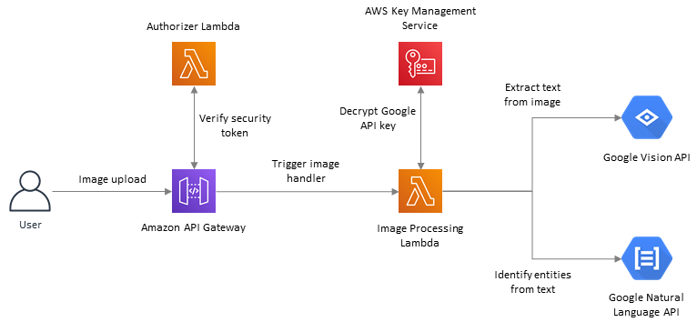

# Image Processing Using Google Vision and NLP APIs
This solution is a reference implementation for serverless image processing using AWS and [Google APIs](https://cloud.google.com/apis). The primary objective is to show how to ingest images from the user into AWS ecosystem and then process them by invoking Google APIs. The solution accepts image data from the user and converts it into text using Google [Vision APIs](https://cloud.google.com/vision). Then, it invokes Google [Natural Language APIs](https://cloud.google.com/natural-language) to identify entities in the text (like name of a person, address etc). The solution then sends *"First name"* and *"Last name"* found in the text as a response back to the user.

 

## Solution Components
The CloudFormation template contains the following:
1. A REST API provided by AWS API Gateway using which user can upload image data for processing.
2. An Authorizer lambda which controls access to the REST API using a token based authorization.
3. The API Gateway implements an OPTIONS object to allow CORS (Cross-Origin Resource Sharing) support.
4. An image processing lambda which invokes Google APIs to extract "First name" and "Last name" from the image provided by user.
5. A *"node modules"* package which contains the dependencies (modules) required by the NodeJS code in image processing lambda. These modules are packaged as a [lambda layer](https://docs.aws.amazon.com/lambda/latest/dg/configuration-layers.html).

## Storing and Transmitting Google API Key Securely
The Image Processing lambda requires an [authentication key](https://cloud.google.com/docs/authentication/api-keys) in order to invoke Google APIs. A convenient option is to provide the key as an environment variable to the lambda. However, it may not be advisable to hold the key in plain text due to various factors. Also, transmitting the key in plain text from client premise over the Internet to AWS servers should be avoided.

To store and transmit API keys securely, following approach is used:
1. Create a new symmetric [Client Managed Key](https://docs.aws.amazon.com/kms/latest/developerguide/create-keys.html) (CMK) using AWS IAM Key Management Service (KMS). Let the key be named `LambdaEnvKey`.
2. On your local system, use [AWS CLI](https://docs.aws.amazon.com/cli/latest/reference/kms/index.html) to encrypt the API key:  
`aws kms encrypt --key-id alias/LambdaEnvKey --plaintext fileb://key.json --output text --query CiphertextBlob > key-encrypted`

   - where `key.json` contains the API key and `key-encrypted` is the corresponding encrypted key as output

The encrypted key can now be specified as an environment variable to the image processing lambda. When this lambda is invoked, it uses [KMS API](https://docs.aws.amazon.com/AWSJavaScriptSDK/latest/AWS/KMS.html) to decrypt the key and use it to call Google APIs.

The approach outlined here is just one of the ways to manage API keys. Alternatively, the keys can also be secured using [AWS Systems Manager Parameter Store](https://docs.aws.amazon.com/systems-manager/latest/userguide/systems-manager-parameter-store.html) or [AWS Secrets Manager](https://aws.amazon.com/secrets-manager/) service.

## Generating NodeJS Dependencies
The solution already provides a package containing dependencies for NodeJS. It was generated using the following [steps](https://docs.aws.amazon.com/sdk-for-javascript/v2/developer-guide/setting-up-node-on-ec2-instance.html):
1. Launch an [EC2](https://console.aws.amazon.com/ec2/) instance. A standard **t2.micro** with *Amazon Linux 2 AMI (HVM) 64-bit (x86)* is sufficient. We will terminate the instance once we generate the dependent libraries.
2. Login to the EC2 instance using an SSH client like [PuTTY](https://www.putty.org/). 
3. Create a folder named `nodejs` and change directory to this new folder.  
`mkdir nodejs`  
`cd nodejs`
4. Copy the [package.json](src/imageProcessingLambda/package.json) file to the EC2 instance and place it inside the `nodejs` folder.
5. Install the [Node Version Manager](https://github.com/nvm-sh/nvm)  
`curl -o- https://raw.githubusercontent.com/nvm-sh/nvm/v0.34.0/install.sh | bash`
6. Activate `nvm`.  
`. ~/.nvm/nvm.sh`
7. Install NodeJS. Since we are using Node v12.x for lambda code, install the corresponding version.  
`nvm install 12.16.1`
8. Confirm that `node` has been successfully installed by running the following command:  
`node --version`  
It should print the following output:  
`v12.16.1`
9. Install the dependencies listed in `package.json`  
`npm install`
10. We no longer need `package.json` and the newly generated `package-lock.json` files.  
`rm package*`
10. The dependencies will be placed in *"node_modules"* folder. Change directory to parent folder and zip the `nodejs` folder.  
`cd ..`  
`zip -X -r node_modules.zip nodejs`
11. Open a terminal on your local system and run the following command to copy the zip file to your local system. This example uses PuTTY on Windows.  
`pscp -i <path to .ppk file> ec2-user@<IP of EC2>:/home/ec2-user/node_modules.zip <your local system folder path>`
12. Terminate the EC2 instance.

## Instructions
1. To invoke Google APIs, you must create a Google Cloud account and generate an [API key](https://cloud.google.com/docs/authentication/api-keys)
2. Deploy the CloudFormation template in AWS
3. Note the API Endpoint URL generated in "Outputs" tab of CloudFormation Stack
4. Convert an image of a business card into base64 format. Several online tools like this [one](https://www.base64-image.de/) are available. A few [sample](docs/sampleImage-1.jpg) [images](docs/sampleImage-2.png) are provided with the solution.
5. Use a tool like [Postman](https://www.postman.com/) to invoke the REST API by providing the following headers:  
`Content-Type: application/json`  
`Authorization: <security token that was specified while deploying the CloudFormation template>`  
Body of the request should be in JSON format:  
`{`  
`  "imgdata": "<base64 image data>"`  
`}`
6. The API will send a response containing the *"First name"* and *"Last name"* identified in the business card image.

## Cleanup
1. Delete the CloudFormation stack.
2. Delete the encryption key created using KMS service.
